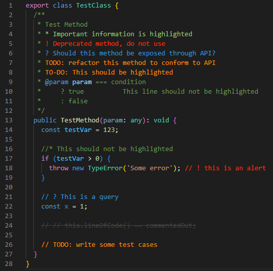

# Better Comments Next

Forked from [aaron-bond/better-comments v3.0.2](https://github.com/aaron-bond/better-comments)

## Features

- [x] Fix matching errors.
- [x] All languages supported. 
- [x] Custom comments configuration for languages configurated by [`vscode.languages.setLanguageConfiguration`](https://code.visualstudio.com/api/references/vscode-api#languages) See [#11](https://github.com/edwinhuish/better-comments-next/issues/11)
- [x] Embedded languages supported. Like SFC of Vue, markdown, HTML, etc. See [#388](https://github.com/aaron-bond/better-comments/issues/388#issuecomment-1527426462)
- [x] Remote workspace supported. See [#507](https://github.com/aaron-bond/better-comments/issues/507)
- [x] Web editor supported.
- [x] Theme switchable. Defferent tag config for light and dark themes. See [#506](https://github.com/aaron-bond/better-comments/issues/506)
- [x] Allow multiple tags per item. See [#33](https://github.com/aaron-bond/better-comments/issues/33)
- [x] Multi-line comment supported. See [#7](https://github.com/edwinhuish/better-comments-next/issues/7#issuecomment-2522526938)


## Decription
The Better Comments extension will help you create more human-friendly comments in your code.
With this extension, you will be able to categorise your annotations into:

* Alerts
* Queries
* TODOs
* Highlights
* Commented out code can also be styled to make it clear the code shouldn't be there
* Any other comment styles you'd like can be specified in the settings



## Configuration

Default setting as below:

```jsonc
{
  // Enable/disable hightlight plain text.
  "better-comments.highlightPlainText": false,
  // Custom languages comments configuration
  "better-comments.languages": [],
  // Overwrite the specified tag styles of `"better-comments.tags"` for light themes.
  "better-comments.tagsLight": [],
  // Overwrite the specified tag styles of `"better-comments.tags"` for dark themes.
  "better-comments.tagsDark": [],
  // Tags for decoration.
  "better-comments.tags": [
    {
      "tag": "#",
      "color": "#18b566",
      "strikethrough": false,
      "underline": false,
      "backgroundColor": "transparent",
      "bold": true,
      "italic": false
    },
    {
      "tag": "!",
      "color": "#FF2D00",
      "strikethrough": false,
      "underline": false,
      "backgroundColor": "transparent",
      "bold": false,
      "italic": false
    },
    {
      "tag": "?",
      "color": "#3498DB",
      "strikethrough": false,
      "underline": false,
      "backgroundColor": "transparent",
      "bold": false,
      "italic": false
    },
    {
      "tag": "//",
      "color": "#474747",
      "strikethrough": true,
      "underline": false,
      "backgroundColor": "transparent",
      "bold": false,
      "italic": false
    },
    {
      "tag": ["todo", "to-do"],
      "color": "#FF8C00",
      "strikethrough": false,
      "underline": false,
      "backgroundColor": "transparent",
      "bold": false,
      "italic": false,
      "multiline": true
    },
    {
      "tag": "*",
      "color": "#98C379",
      "strikethrough": false,
      "underline": false,
      "backgroundColor": "transparent",
      "bold": false,
      "italic": false
    }
  ]
}
```

## Supported Languages

Most languages that your editor correctly recognizes.

`better-comments-next` reads the language configuration JSON in [contributes.languages](https://code.visualstudio.com/api/references/contribution-points#contributes.languages) to know what comments look like in a language. Some language extensions provide that information dynamically via the [`vscode.languages.setLanguageConfiguration`](https://code.visualstudio.com/api/references/vscode-api#languages) API method. This extension is unable to support those languages.
