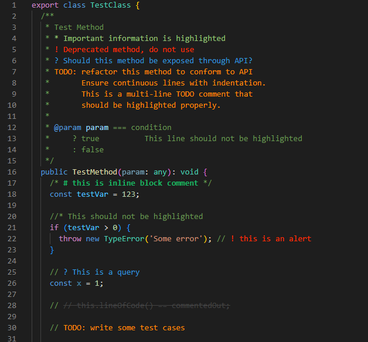

# Better Comments Next

The Better Comments extension will help you create more human-friendly comments in your code.
With this extension, you will be able to categorise your annotations into:

* Alerts
* Queries
* TODOs
* Highlights
* Commented out code can also be styled to make it clear the code shouldn't be there
* Any other comment styles you'd like can be specified in the settings



## Configuration

Default setting as below:

```jsonc
{
  // Enable/disable block comment decoration.
  "better-comments.multilineComments": true,
  // Enable/disable hightlight plain text.
  "better-comments.highlightPlainText": false,
  // Overwrite the specified tag styles of `"better-comments.tags"` for light themes.
  "better-comments.tagsLight": [],
  // Overwrite the specified tag styles of `"better-comments.tags"` for dark themes.
  "better-comments.tagsDark": [],
  // Tags for decoration.
  "better-comments.tags": [
    {
      "tag": "#",
      "color": "#18b566",
      "strikethrough": false,
      "underline": false,
      "backgroundColor": "transparent",
      "bold": true,
      "italic": false
    },
    {
      "tag": "!",
      "color": "#FF2D00",
      "strikethrough": false,
      "underline": false,
      "backgroundColor": "transparent",
      "bold": false,
      "italic": false
    },
    {
      "tag": "?",
      "color": "#3498DB",
      "strikethrough": false,
      "underline": false,
      "backgroundColor": "transparent",
      "bold": false,
      "italic": false
    },
    {
      "tag": "//",
      "color": "#474747",
      "strikethrough": true,
      "underline": false,
      "backgroundColor": "transparent",
      "bold": false,
      "italic": false
    },
    {
      "tag": ["todo", "to-do"],
      "color": "#FF8C00",
      "strikethrough": false,
      "underline": false,
      "backgroundColor": "transparent",
      "bold": false,
      "italic": false
    },
    {
      "tag": "*",
      "color": "#98C379",
      "strikethrough": false,
      "underline": false,
      "backgroundColor": "transparent",
      "bold": false,
      "italic": false
    }
  ]
}
```

## Supported Languages

Any language that your editor correctly recognizes. (
`better-comments-next` read the extensions language configuration JSON in [contributes.languages](https://code.visualstudio.com/api/references/contribution-points#contributes.languages) to know what comment use for the each language. )
